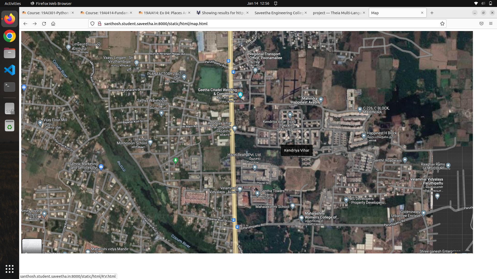
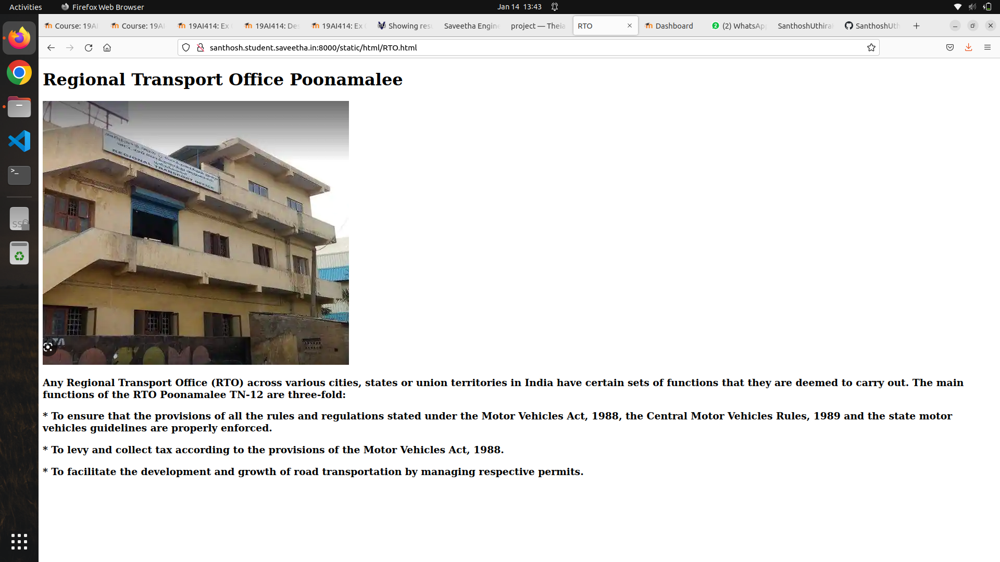
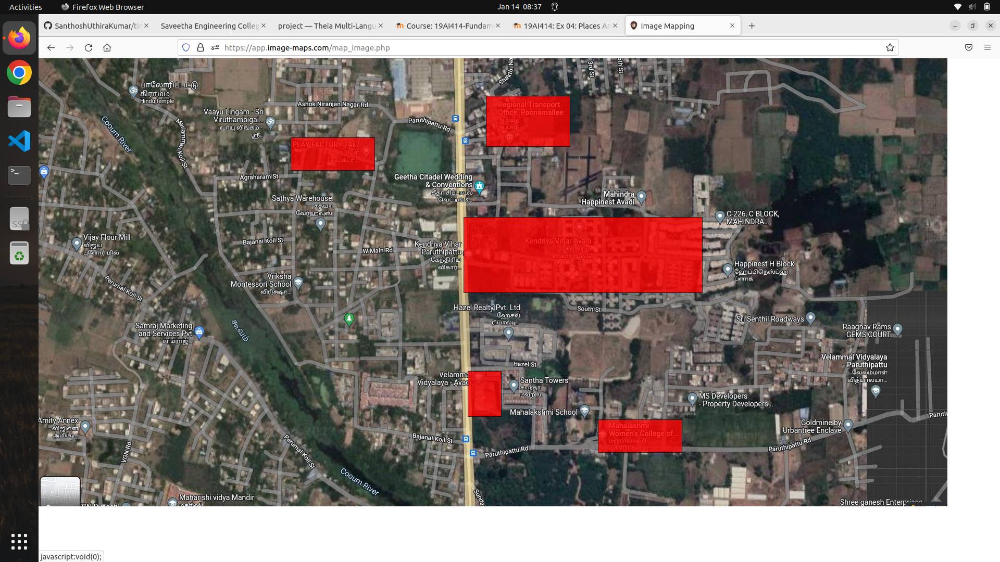
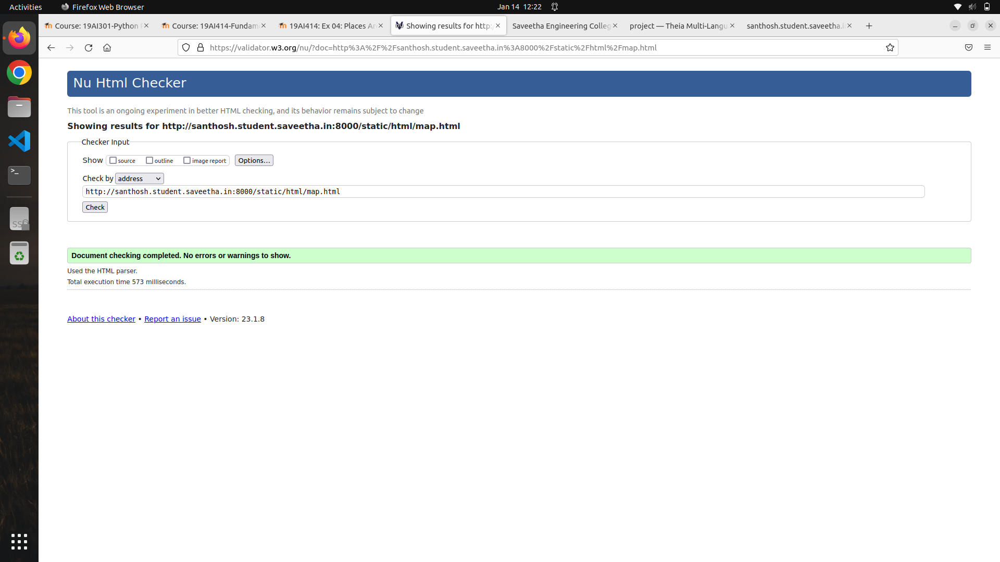

# Places Around Me
## AIM:
To develop a website to display details about the places around my house.

## Design Steps:

### Step 1:
Create a new folder and clone the git repository.
### Step 2:
Create a new project using command "django-admin startproject myproj" and include the necessary details in settings.py.
### Step 3:
Create a new folder "static" in myproj.In static , create new folder "html".In html,create new file "map.html".
### Step 4:
Upload your screenshot in image-maps.com of your locality taken from Googlemaps and select the places you want to show the details.
### Step 5:
Get the code and paste it in your html files.Create necessary html pages and attach them in main html file
### Step 6:
Execute the Program

## Code:
### map.html
```
<!DOCTYPE html>
<html lang="">
    <head><title>Map</title>
        <meta charset="UTF-8">
    </head>
    <body>
        
        <map name="image-maps-2023-01-14-030050" id="image-maps-2023-01-14-030050">
        <area  alt="" title="Kendriya Vihar" href="KV.html" shape="rect" coords="816,305,1275,451" style="outline:none;" target="_self"     >
        <area  alt="" title="Regional Transport Office Poonamallee" href="RTO.html" shape="rect" coords="859,72,1021,170" style="outline:none;" target="_self"     >
        <area  alt="" title="Play Factory 24/7" href="PlayFactory.html" shape="rect" coords="484,152,646,216" style="outline:none;" target="_self"     >
        <area  alt="" title="Mahalakshmi Womens College of Arts and Science" href="College.html" shape="rect" coords="1074,694,1236,758" style="outline:none;" target="_self"     >
        <area  alt="" title="Velammal Vidyalaya - Avadi" href="School.html" shape="rect" coords="824,601,889,689" style="outline:none;" target="_self"     >
        <area shape="rect" coords="1743,859,1745,861" alt="Image Map" style="outline:none;" title="Image Map" href="https://www.image-maps.com/" >
        </map>
    </body>
</html>
```
### KV.html
```
<!DOCTYPE html>
<html lang="">
    <head><title>Kendriya Vihar</title>
        <meta charset="UTF-8">
        <h1>Kendriya Vihar</h1>
        
        <h3>
            Kendriya Vihar is a residential project in Avadi, Chennai. Kendriya Vihar is located in Avadi Poonamallee High Road, Near Sri Archana Marriage Hall, Phase - II.Avadi is a prime area, with many attractions work and recreational options just a drive away.
        </h3>
        <h3>
            Kendriya Vihar Avadi in Chennai is one of the leading Business in the residential building.Kendriya Vihar Avadi in Avadi.Chennai is known to satisfactorily cater to the demands of its customer base.It stands located at Paruthipet,Avadi,Avadi-600054.It has earned 100 reviews and aspires to develop a loyal customer base .The busines strives to make for a positive experience through its offerings.
        </h3>
    </body>
</html>
```
### RTO.html
```
<!DOCTYPE html>
<html lang="">
    <head><title>RTO</title>
        <meta charset="UTF-8">
        <h1>Regional Transport Office Poonamalee</h1>
        
        <h3>
            Any Regional Transport Office (RTO) across various cities, states or union territories in India have certain sets of functions that they are deemed to carry out. The main functions of the RTO Poonamalee TN-12 are three-fold:
        </h3>
        <h3>* To ensure that the provisions of all the rules and regulations stated under the Motor Vehicles Act, 1988, the Central Motor Vehicles Rules, 1989 and the state motor vehicles guidelines are properly enforced.</h3>
        <h3>* To levy and collect tax according to the provisions of the Motor Vehicles Act, 1988.</h3>
        <h3>* To facilitate the development and growth of road transportation by managing respective permits.</h3>
    </body>
</html>
```
### PlayFactory.html
```
<!DOCTYPE html>
<html lang="">
    <head><title>PlayFactory</title>
        <meta charset="UTF-8">
        <h1>Play Factory 24/7</h1>
        
        <h3>
            Play Factory 24/7 is a training spot for sports and other extra curicular activities.They traine the learners in Badminton,Table Tennis,Tennis,Gym,Cricket,nets,Football,Dance,Music,Singing,Yoga,Chess,Carrom,Skating,Archery,Sports etc.Their Mission is to Inspire our valuable customers to achieve their fitness goals with the finest world-class fitness equipment, knowledgeable coaches, and a safe, fun, and healthy lifestyle with our eco-friendly atmosphere

        </h3>                                         
    </body>
</html>
```
### College.html
```
<!DOCTYPE html>
<html lang="">
    <head><title>Mahalakshmi College</title>
        <meta charset="UTF-8">
        <h1>Mahalakshmi Womens College of Arts and Science</h1>
        
        <h3>The Mahalakshmi Womens College Of Arts And Science is a self-financing college established in the year 1998 with the aim of imparting arts & medical courses BBA, BCA, MCA, BSc. engineering & other degree courses to the students. The college offers an array of courses that will facilitate the learning skills in the students & help them to reach success ladder.They have various arts and science degrees including PG programmes.The College is built to focus on women's career and their future.</h3>
    </body>
</html>
```
### School.html
```
<!DOCTYPE html>
<html lang="">
    <head><title>Velammal School</title>
        <meta charset="UTF-8">
        <h1>Velammal Matriculation School</h1>
        
        <h3>
            Velammal Matriculation School lacated in Velammal Garden, Velammal avenue Poonamallee-Avadi High Road, Chennai – 600 071.The School was established in 2016 with only class of 1-7th Grade .They follow State Board of Tamilnadu, India.Velammal Matriculation School is approved by Directorate of Matriculation Schools,
Govt. of Tamil nadu, India.Velammal Groups have various school all over Tamil Nadu and mainly in Chennai.They started this institution to help students to achieve success in good ways.
        </h3>
    </body>
</html>
```

## Output:





## Result:
A website to display details about the places around my house is executed successfully